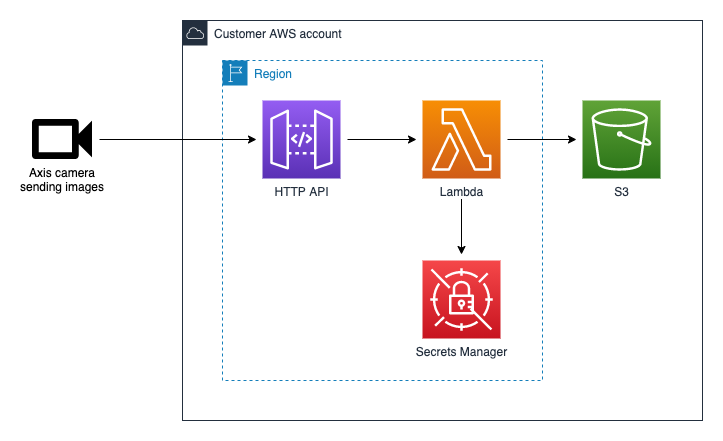

*Copyright (C) 2021, Axis Communications AB, Lund, Sweden. All Rights Reserved.*

# Sending images from a camera to AWS S3

## Table of contents

- [Overview](#overview)
- [Prerequisites](#prerequisites)
- [Structure of this example](#structure-of-this-example)
- [Deploy the AWS resources](#deploy-the-aws-resources)
- [Configure the camera](#configure-the-camera)
- [Cleanup](#cleanup)

## Overview

In this example we create an application that sends images from an Axis camera to AWS S3. We start with building and deploying the [AWS Serverless Application Model (AWS SAM)](https://docs.aws.amazon.com/serverless-application-model/latest/developerguide/what-is-sam.html), and then continue with configuring the camera.



The application consists of the following AWS resources.

- API Gateway
- API Gateway Lambda authorizer
- Access token stored in Secrets Manager
- Lambda function
- S3 bucket

As the camera is not able to sign requests using [AWS Signature Version 4](https://docs.aws.amazon.com/general/latest/gr/signature-version-4.html) we need to include a Lambda function to handle this step. Rather than sending images directly from the Axis camera to AWS S3 we instead send them to an API Gateway. The API Gateway delegates authorization to a Lambda authorizer that compares the provided access token to an access token stored in Secrets Manager. If the provided access token is deemed valid the API Gateway forwards the request to a Lambda function which proceeds that uploading the provided image to an AWS S3 bucket.

## Prerequisites

- A network camera from Axis Communications
- Node.js - [Install Node.js 14](https://nodejs.org/en/)
- AWS SAM CLI - [Install the AWS SAM CLI](https://docs.aws.amazon.com/serverless-application-model/latest/developerguide/serverless-sam-cli-install.html)

## Structure of this example

```
images-to-aws-s3
├── src
│   ├── authorizer - contains code authorizing requests to AWS API Gateway
│   │   ├── env.js - Exports environment variables
│   │   ├── index.js - Exports the AWS Lambda handler function
│   │   └── secrets.js - Exports a function capable of reading the access token from AWS Secrets Manager
│   └── upload-to-s3 - contains code uploading images to AWS S3
│       ├── env.js - Exports environment variables
│       ├── index.js - Exports the AWS Lambda handler function
│       └── response.js - Exports common HTTP responses
├── .npmignore - npm package ignore file
├── configure-camera.sh - bash script capable of configuring an Axis camera to send images
├── package-lock.json - npm package lock file
├── package.json - npm package
└── template.yaml - SAM template describing the AWS resources
```

## Deploy the AWS resources

Let's start with building and deploying the AWS resources receiving the images sent from an Axis camera. The resources are described in `template.yaml` using AWS SAM.

To build and deploy your application for the first time, run the following commands in your shell.

```bash
sam build
sam deploy --guided
```

The first command will build the source of your application. The second command will package and deploy your application to AWS, with a series of prompts.

- **Stack Name**: The name of the CloudFormation stack. This should be unique to your account and region, and a good starting point would be `images-to-aws-s3` or something similar.
- **AWS Region**: The AWS region you want to deploy your app to.
- **Confirm changes before deploy**: If set to yes, any change sets will be shown to you before execution for manual review. If set to no, the AWS SAM CLI will automatically deploy application changes.
- **Allow SAM CLI IAM role creation**: This AWS SAM template creates AWS IAM roles required for the AWS Lambda function to access AWS services. By default, these are scoped down to minimum required permissions. Select `Y` to have SAM automatically create the roles.
- **Save arguments to samconfig.toml**: If set to `Y`, your choices will be saved to a configuration file inside the project, so that in the future you can just re-run `sam deploy` without parameters to deploy changes to your application.

After a successful deployment navigate to your newly created AWS CloudFormation stack in the AWS Console. The stack will contain two output parameters. One is called `Recipient` and defines the URL of the AWS HTTP API where cameras should send their images. The other is called `ApiAccessToken` and contains the URL to the secret API access token found in AWS Secrets Manager. This API access token authorizes the camera and allows it to send images. Requests to the AWS HTTP API without this access token will be denied access. Both these output parameters will be used in the next chapter where we configure the camera.

## Configure the camera

Now that the resources in AWS are ready to accept images, let's continue with configuring the camera to send them.

We have two alternatives when it comes to configuring the camera. The first alternative is to use a bash script, suited for a situation when you wish to configure the camera without knowing the intricate details, or for when you wish to configure a fleet of cameras. The second alternative is to manually configure the camera using its user interface, for when you wish to understand more about the different capabilities of the camera. Both alternatives are described in upcoming chapters.

### Configure the camera using a bash script

The bash script `configure-camera.sh` depends on *curl* being installed on your system, and should be called with the following positional arguments.

1. `address` - The IP address or hostname of the Axis camera
1. `username` - The username used when accessing the Axis camera
1. `password` - The password used when accessing the Axis camera
1. `recipient` - The URL of the AWS API Gateway, defined as a CloudFormation output parameter
1. `access token` - The access token authorizing requests, linked from a CloudFormation output parameter

The following output indicate a successful configuration, where the camera will start to send a new image to your AWS S3 bucket every minute.

```bash
./configure-camera.sh "192.168.0.90" "root" "my-password" "https://my-recipient.com" "my-access-token"
Adding recipient...
Adding schedule...
Adding rule...

Done!
```

### Configure the camera using the user interface

Navigate to the camera using your preferred web browser. In the user interface of the camera, select *Settings* -> *System* -> *Events* -> *Device events*. In this user interface we'll do all configuration, but first let's get familiar with the available tabs.

- **Rules** - Here we'll create a rule that sends images to our AWS S3 bucket
- **Schedules** - In this sample we'll use a schedule to define *when* an image should be sent. If a schedule doesn't fit your specific use case, you can replace it with any event generated on the camera or even an event generated by any ACAP installed on the camera.
- **Recipients** - Here we'll define *where* images are sent

Let's start with *Recipients*. Select the tab and create a new recipient with the following settings.

- **Name**: `AWS S3`
- **Type**: `HTTPS`
- **URL**: Back when we deployed the AWS resources using CloudFormation stacks we talked about output parameters. You'll have to get the value of the output parameter named `Recipient` and enter it here.

Click the *Save* button.

Now let's navigate to the *Schedules* tab. In this sample we'll use a schedule to define when an image should be send. Create a new schedule with the following settings.

- **Type**: `Pulse`
- **Name**: `Every minute`
- **Repeat every**: `1 Minute`

Click the *Save* button.

Now let's navigate to the *Rules* tab. Here we'll finally create a rule that combines the recipient and the schedule into a rule. Create a new rule with the following settings.

- **Name**: `Images to AWS S3`
- **Condition**: `Pulse`
    - **Pulse**: `Every Minute`
- **Action**: `Send images through HTTPS`
    - **Recipient**: `AWS S3`
    - **Maximum images**: `1`
    - **Custom CGI parameters**: Back when we deployed the AWS resources using CloudFormation stacks we talked about output parameters. The output parameter `ApiAccessToken` points to a secret in AWS Secrets Manager. Follow the link, retrieve the secret value and format it according to `accessToken=<secret value>`. E.g. if the secret value is `FooBar` then the value you should enter here is `accessToken=FooBar`. Please note that copying the secret from AWS Secrets Manager sometimes adds a space in the beginning of the secret. Please make sure to remove this space before saving the rule.

Click the *Save* button.

At this point the rule will become active and send an image to AWS S3 every minute.

## Cleanup

To delete the deployed AWS resources, delete the CloudFormation stack either via the AWS Console or via the AWS CLI using the following command.

```bash
aws cloudformation delete-stack --stack-name <CloudFormation stack name>
```
