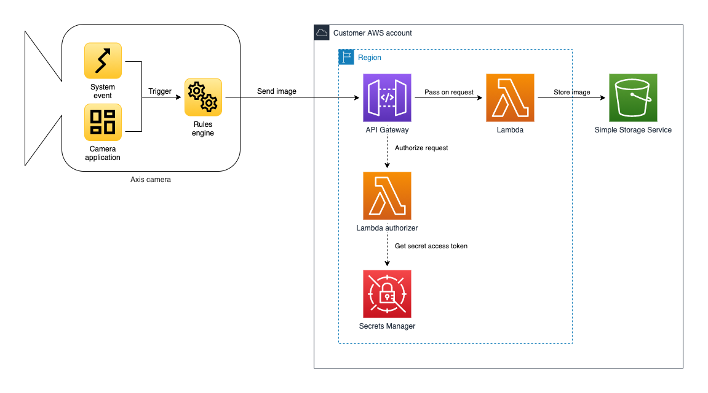

*Copyright (C) 2021, Axis Communications AB, Lund, Sweden. All Rights Reserved.*

# Sending images from a camera to AWS S3

## Overview

In this example, we deploy the AWS resources required to receive and store the images, and configures the camera to send an image when a specific event occurs.



## Table of contents

- [Prerequisites](#prerequisites)
- [Deploying the AWS services](#deploying-the-aws-services)
- [Configuring the camera](#configuring-the-camera)
- [Cleanup](#cleanup)

---

## Prerequisites

* A network camera from Axis Communications
* AWS SAM CLI - [Install the AWS SAM CLI](https://docs.aws.amazon.com/serverless-application-model/latest/developerguide/serverless-sam-cli-install.html)
* Node.js - [Install Node.js 14](https://nodejs.org/en/)

## Deploying the AWS services

Let's start with building and deploying the AWS services receiving the images sent from a network camera. The services are described in `template.yaml` using the [AWS Serverless Application Model (AWS SAM)](https://docs.aws.amazon.com/serverless-application-model/latest/developerguide/what-is-sam.html).

To build and deploy your application for the first time, run the following commands in your shell.

```bash
sam build
sam deploy --guided
```

The first command will build the source of your application. The second command will package and deploy your application to AWS, with a series of prompts.

- **Stack Name**: The name of the stack to deploy to CloudFormation. This should be unique to your account and region, and a good starting point would be `images-to-aws-s3` or something similar.
- **AWS Region**: The AWS region you want to deploy your app to.
- **Confirm changes before deploy**: If set to yes, any change sets will be shown to you before execution for manual review. If set to no, the AWS SAM CLI will automatically deploy application changes.
- **Allow SAM CLI IAM role creation**: This AWS SAM template creates AWS IAM roles required for the AWS Lambda function to access AWS services. By default, these are scoped down to minimum required permissions. Select `Y` to have SAM automatically create the roles.
- **Save arguments to samconfig.toml**: If set to `Y`, your choices will be saved to a configuration file inside the project, so that in the future you can just re-run `sam deploy` without parameters to deploy changes to your application.

After a successful deployment navigate to your newly created AWS CloudFormation stack in the AWS Console. You'll find the AWS HTTP API forwarding requests to AWS Lambda, and the Lambda in turn will save the images into an AWS S3 bucket.

The deployed CloudFormation stack created two output parameters. One is called `Recipient` and defines the URL of the AWS HTTP API where cameras should send their images. The other one is called `ApiAccessToken` and contains the URL to the secret API access token found in AWS Secret Manager. This API access token authorizes the camera and allows it to send images. Requests to the AWS HTTP API without this access token will be denied access. Both these output parameters will be used in the next chapter where we configure the camera.

## Configuring the camera

Now that the receiving end of the sample is deployed and ready, let's continue with configuring the network camera to send images.

First off you need to get access the camera. If you just connected the camera to the network and don't know its IP address you can use either [AXIS IP Utility](https://www.axis.com/support/downloads/axis-ip-utility) or [AXIS Device Manager](https://www.axis.com/products/axis-device-manager) to find the camera on the network. Once found, navigate to it using your preferred browser.

Using the user interface of the camera, select *Settings* -> *System* -> *Events* -> *Device events*. In this user interface we'll do all configuration, but first let's get an overview of the available tabs.

- **Rules** - Here we'll create a rule that sends images to our AWS S3 bucket
- **Schedules** - In this sample we'll use a schedule to define *when* a image should be sent. If a schedule doesn't fit your specific use case, you can replace it with any event generated on the camera or even events generated by ACAPs installed on the camera.
- **Recipients** - Here we'll define *where* images are send

Let's start with *Recipients*. Select the tab and create a new recipient with the following settings.

- **Name**: `AWS S3`
- **Type**: `HTTPS`
- **URL**: Back when we deployed the AWS services using CloudFormation stacks we talked about output parameters. You will have to get the value of the output parameter named `Recipient` and enter it here.

Click the *Save* button.

Now let's navigate to the *Schedules* tab. In this sample we'll use a schedule to define when a image should be send. Create a new schedule with the following settings.

- **Type**: `Pulse`
- **Name**: `Every minute`
- **Repeat every**: `1 Minute`

Click the *Save* button.

Now let's navigate to the *Rules* tab. Here we'll finally create a rule that combines the recipient and the schedule into a rule. Create a new rule with the following settings.

- **Name**: `Images to AWS S3`
- **Condition**: `Pulse`
    - **Pulse**: `Every Minute`
- **Action**: `Send images through HTTPS`
    - **Recipient**: `AWS S3`
    - **Maximum images**: `1`
    - **Custom CGI parameters**: Back when we deployed the AWS services using CloudFormation stacks we talked about output parameters. The output parameter `ApiAccessToken` points to the secret in AWS Secret Manager. Follow the link, retrieve the secret value and format it according to `accessToken=<secret value>`. E.g. if the secret value is `FooBar` then the value you should enter is `accessToken=FooBar`. Please note that copying the secret from AWS Secret Manager sometimes adds a space in the beginning secret. Make sure to remove that space before saving the rule.

Click the *Save* button.

At this point the rule will become active and send a image to AWS S3 every minute.

## Cleanup

To delete the deployed AWS services, either use the AWS Console, or delete the CloudFormation stack using the AWS CLI in your shell.

```bash
aws cloudformation delete-stack --stack-name <images-to-aws-s3 or whatever you named your stack>
```
