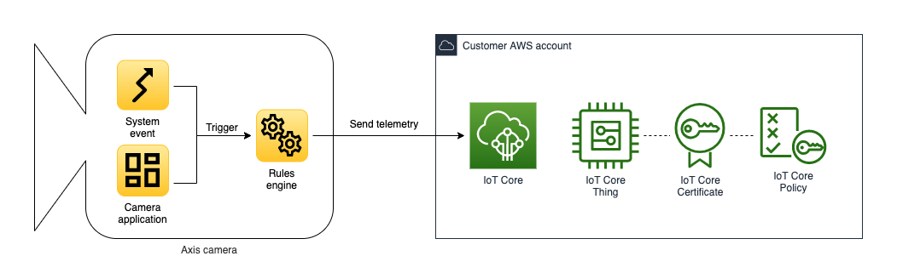

*Copyright (C) 2021-2022, Axis Communications AB, Lund, Sweden. All Rights Reserved.*

<!-- omit in toc -->
# Telemetry to AWS IoT Core

[](https://github.com/AxisCommunications/acap-integration-examples-aws/actions/workflows/telemetry-to-aws-iot-core.yml)
[](https://github.com/AxisCommunications/acap-integration-examples-aws/actions/workflows/lint.yml)


<!-- omit in toc -->
## Table of contents

- [Overview](#overview)
- [Prerequisites](#prerequisites)
- [File structure](#file-structure)
- [Command-line interface](#command-line-interface)
- [Instructions](#instructions)
    - [Deploy AWS resources](#deploy-aws-resources)
    - [Configure the camera](#configure-the-camera)
- [Cleanup](#cleanup)
- [Troubleshooting](#troubleshooting)
    - [MQTT client cannot connect to AWS IoT Core](#mqtt-client-cannot-connect-to-aws-iot-core)
- [License](#license)

## Overview

In this example we create an application where we send telemetry data from our camera up to IoT Core in AWS. Telemetry data from the camera could be motion detection events or custom events from ACAP applications installed on the camera.



The application consists of the following AWS resources.

- AWS IoT Core Thing
- AWS IoT Core Certificate
- AWS IoT Core Policy

An Axis camera has an internal MQTT client that will connect to IoT Core in AWS. The camera authenticates to IoT Core using an X.509 certificate.

## Prerequisites

- A network camera from Axis Communications (example has been verified to work on a camera with firmware >=10.4)
- AWS CLI ([install](https://docs.aws.amazon.com/cli/latest/userguide/install-cliv2.html) and [configure](https://docs.aws.amazon.com/cli/latest/userguide/cli-chap-configure.html))
- curl ([install](https://curl.se/))

## File structure

<!-- markdownlint-disable MD040 -->
```
telemetry-to-aws-iot-core
├── create-cloud-resources.sh - Bash script that creates AWS resources and certificates for secure communication between camera and cloud
└── template.yaml - AWS CloudFormation template describing the AWS resources
```

## Command-line interface

To follow the procedures in this example you need a command-line interface or shell to run commands.

In some command listings, the commands are described as is, ready to be copied to your command-line interface and executed.

<!-- markdownlint-disable MD040 -->
```
this is a command
```

In other command listings, commands are preceded by a prompt symbol (`$`) when the output of the command also is of importance.

<!-- markdownlint-disable MD040 -->
```
$ this is a command
> This is output
```

Command listings where your input is required are marked using angle brackets (`<` and `>`).

```sh
some-command <your input>
```

For long commands, we use an escape character (`\`) to split a command over multiple lines.

On Linux and macOS, use your preferred shell and package manager. On Windows 10, you can [install the Windows Subsystem for Linux](https://docs.microsoft.com/windows/wsl/install) to get a Windows-integrated version of Ubuntu and Bash.

## Instructions

The instructions are divided into two parts. The first part covers deploying the AWS resources and the second part covers configuring the camera.

To start off, make sure to clone the repository and navigate into the example directory.

```sh
git clone https://github.com/AxisCommunications/acap-integration-examples-aws.git
cd acap-integration-examples-aws/telemetry-to-aws-iot-core
```

### Deploy AWS resources

Let's deploy the AWS resources required to receive telemetry from a camera. The bash script `create-cloud-resources.sh` should be called with the following positional arguments.

1. **Stack name**: The name of the AWS CloudFormation stack, e.g. `axis-device-telemetry`
1. **Thing name**: The name of the AWS IoT Core Thing, e.g. `device01`

The following output indicates that all resources have been created successfully.

```
$ ./create-cloud-resources.sh axis-device-telemetry device01
> Downloading Amazon root CA certificate...
>     ./cert/AmazonRootCA1.pem
> Create principal certificate...
>     ./cert/device01.crt
>     ./cert/device01.key
> Deploy AWS CloudFormation template...
>
> Waiting for changeset to be created..
> Waiting for stack create/update to complete
> Successfully created/updated stack - axis-device-telemetry
>
> Done!
>
> The following settings will be used when configuring the camera.
>
> MQTT Client Configuration
> Host:       abcdefghijklmn-ats.iot.us-west-1.amazonaws.com
> Client id:  device01
```

We will use the MQTT host and client ID in the upcoming chapter where we configure the camera.

### Configure the camera

Now that the resources in AWS are ready to accept telemetry, let's continue with configuring the camera to send events.

We will begin by uploading our AWS IoT Thing certificate to the camera. Start by navigating to the camera using your preferred web browser. To add a client certificate, follow the steps below.

1. In the user interface of the camera, select *Settings* -> *System* -> *Security*
1. Under the list of *Client certificates*, click on "*+*" to add a new certificate
1. Select *Upload certificate* and click on *OK*
1. Select *Separate private key*
1. For the certificate, click on *Select file* and browse to `cert/` and select `<thing name>.crt`, e.g. `device01.crt`
1. For the private key, click on *Select file* and browse to `cert/` and select `<thing name>.key`, e.g. `device01.key`
1. Click on *Install*

Next we have the AWS CA certificate. To add it to the camera, follow the steps below.

1. While still in *Security*, under the list of *CA certificates*, click on "*+*" to add a new certificate
1. Click on *Select file* and browse to `cert/` and select `AmazonRootCA1.pem`
1. Click on *Install*

The next step is to configure the MQTT client on the camera.

1. In the user interface of the camera, select *Settings* -> *System* -> *MQTT*
1. In the *Server* section use the following settings
    - **Protocol**: `MQTT over SSL`
    - **Host**: `<aws iot core host>`, i.e. the host echoed in the final step of the previous chapter
    - **Port**: `8883`
1. Under the *Certificate* section use the following settings
    - **Client certificate**: `<thing name>`, e.g. `device01`
    - **CA certificate**: `AmazonRootCA1`
    - **Validate server certificate**: `checked`
1. Under the *Policies* section use the following sections
    - **Client ID**: `<thing name>`, e.g. `device01`
1. Click *Save*

Once the settings are saved, click on *Connect* on the top of the MQTT settings page.

Let's continue with configuring the events the camera should send AWS IoT Core. For the sake of simplicity we create a new schedule that triggers an event every 5 seconds, because the event is predictable and doesn't require any physical access to the camera. You can change this event to any type sent by the camera or an installed ACAP application.

1. In the user interface of the camera, select *Settings* -> *System* -> *Events* -> *Device events* -> *Schedules*
1. Create a new schedule with the following settings
    - **Type**: `Pulse`
    - **Name**: `Every 5 seconds`
    - **Repeat every**: `5 Seconds`
1. Click *Save*

Finally select pulses to be the event type the camera sends to AWS IoT Core.

1. While still in *Events*, select *MQTT events*
1. In the *Publish* section use the following settings
    - **Use default condition prefix**: `Off`
    - **Custom condition prefix**: `<thing name>`, e.g. `device01`
    - **Include condition name**: `checked`
    - **Include condition namespaces**: `unchecked`
    - **Include serial number in payload**: `checked`
1. In the *Event filter list* section use the following settings
    - **Condition**: `Pulse`
1. Click on *Save*

At this point the camera is sending a new event every 5 seconds to AWS IoT Core. Proceed with viewing the events in AWS IoT Core in the AWS Console.

1. Navigate to the [AWS IoT Core](https://console.aws.amazon.com/iot) service in the AWS Console.
1. On the left side, expand *Test* and select the *MQTT test client*
1. In the *Subscribe to a topic* tab, enter the topic wildcard character `#` anc click the *Subscribe* button

## Cleanup

To delete the deployed AWS resources, delete the AWS CloudFormation stack either via the AWS Console or via the AWS CLI using the following command.

```sh
aws cloudformation delete-stack --stack-name <stack name>
```

## Troubleshooting

This section will highlight some of the common problems one might encounter when running this example application.

### MQTT client cannot connect to AWS IoT Core

If the MQTT client is unable to successfully connect to AWS IoT Core, please make sure that the following statements are true.

- **The camera is not behind a proxy**. This example does not support a network topology where requests needs to traverse a proxy to reach the internet.
- **The camera date and time is correctly configured**. The date and time of the camera needs to be correctly configured.

## License

[Apache 2.0](./LICENSE)
